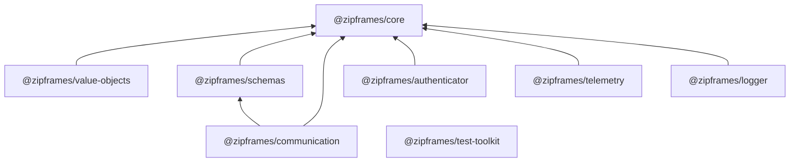

# Estrutura

## Repositório

```
zipframes-packages/
├── packages/
│   ├── <pacote>/
│   │   ├── src/
│   │   ├── test/
│   │   ├── package.json
│   │   ├── tsconfig.json
│   │   └── README.md
│   └── ...
├── docs/
└── .changeset/
```

Cada pacote é publicável de forma independente, com sua própria versão, seu próprio `package.json` e seu próprio README. Um pacote pode depender de outro deste repositório, desde que a dependência aponte para o centro: `core` e `value-objects` não dependem de ninguém, e os demais podem depender deles.



## Pacotes

### `schemas`

Contratos de eventos e de API. É o published language entre os bounded contexts, então a organização espelha os serviços que publicam cada contrato.

```
src/
├── shared/          # envelope do evento, tipos comuns, versionamento
└── services/
    ├── auth-service/
    ├── video-service/
    ├── processor-worker/
    └── notification-service/
```

Cada pasta de serviço traz os schemas dos eventos que aquele serviço publica e dos endpoints que ele expõe. Quem consome importa o schema do serviço publicador, o que deixa claro no import quem é o dono do contrato.

### `value-objects`

```
src/
├── base/            # o value object base (defineValueObject)
├── email/           # Email
├── phone/           # Phone (telefone brasileiro)
├── cpf/             # Cpf
├── cnpj/            # Cnpj
└── name/            # Name
```

Uma pasta por value object, e não agrupada por categoria: `Cpf` e `Cnpj` ficam
lado a lado com `Email`, `Phone` e `Name`, já que são poucos e a busca por nome do
arquivo já resolve. `Address`/`CEP` saiu do escopo por não ser usado em
nenhum lugar do domínio do ZipFrames — pode voltar se um serviço precisar.

Só entra o que é universal. O contrato da base está em [value-objects.md](value-objects.md).

### `core`

```
src/
├── result/          # Result, ok, err e combinadores
├── branded/         # branded types
└── errors/          # erros base de domínio e de aplicação
```

Nenhuma dependência externa. É o único pacote, junto com `value-objects`, que a camada de domínio dos serviços pode importar.

### `communication`

```
src/
├── publisher/       # publisher confirms e outbox relay
├── consumer/        # consumo com ack manual e prefetch
├── retry/           # backoff e roteamento para DLQ
└── topology/        # declaração de exchanges, filas e bindings
```

Encapsula o broker atrás de interfaces. Nenhum serviço importa `amqplib` diretamente.

### `logger`

```
src/
├── logger/          # logger estruturado em JSON
└── correlation/     # propagação de correlationId
```

### `telemetry`

```
src/
├── metrics/         # registro e helpers de métricas Prometheus
└── tracing/         # inicialização do OpenTelemetry e propagação de contexto
```

### `authenticator`

```
src/
├── jwks/            # busca e cache das chaves públicas
└── verify/          # verificação de assinatura, emissor, audiência e expiração
```

Verifica quem é o usuário. Não emite tokens, que é papel do auth-service, e não decide o que ele pode fazer, que é regra de cada serviço.

### `test-toolkit`

```
src/
└── containers/      # containers de PostgreSQL, RabbitMQ, Redis e storage
```

Não depende dos outros pacotes. É sempre uma `devDependency` nos serviços.

## Convenções

- **Exports explícitos.** Cada pacote define seus pontos de entrada no `package.json`. Nada de importar caminhos internos (`@zipframes/core/dist/...`).
- **Um assunto por pacote.** Se um pacote precisa de um nome com "e" no meio para ser descrito, provavelmente são dois.
- **Sem dependência de framework nos pacotes de domínio.** `core` e `value-objects` não importam nada além da biblioteca padrão.
- **Testes junto do pacote**, em `test/`, rodando isoladamente.
- **README por pacote**, dizendo o que ele resolve, o que não é dele e como usar.
